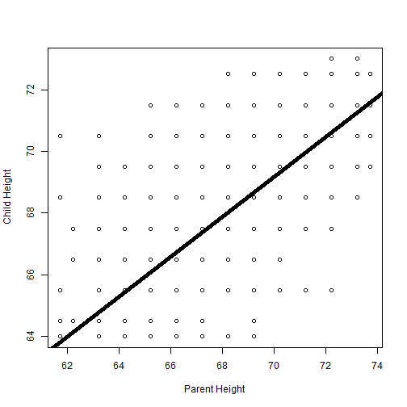

---
title       : Shiny App Presentation
subtitle    : Document the Shiny App as part of Coursera Data Product Project
author      : Kaushik Mitra
job         : Data Science
framework   : io2012        # {io2012, html5slides, shower, dzslides, ...}
highlighter : highlight.js  # {highlight.js, prettify, highlight}
hitheme     : solarized_light      # 
widgets     : [bootstrap,quiz]            # {mathjax, quiz, bootstrap}
mode        : selfcontained # {standalone, draft}
knit        : slidify::knit2slides
--- 

## Background

The shiny application is created as part of the Coursera Data Science project for Development of Data Product Class. 
This is a very simple application to predict child height if the user choose parent height. This application uses the galton data from UsingR package. 

--- .class #id 

## How To Run the Application

There is following steps to run the application -

- Enter Parent Height by appropriately selecting the "up" or "down" arrow in the   box below field -"Parent Height inches"
- You can choose parent height from the range 64 inches to 73 inches. 
- The application will not allow you to enter parent height less than 64 inches    or more than 73 inches
- By default 68 inche will be displayed in the input screen. 
- After choosing appropriate parent height ,click on the button "Submit"
- The right hand part of the screen will display what value you entered and the    predicted child height.

--- &radio .class #id 

## Question 

Which R dataset contains the parent ,child height data ?

1. mtcars
2. _galton_
3. swiss
4. diamond

*** .hint 

Francis Galton explored the relationship between parent and child height

*** .explanation 

galton

--- .class #id 

## Additional Note
The application uses the galton data from UsingR package to fit a linear regression between child height vs parent height. And based on the regression it predicts the child height. 
 

